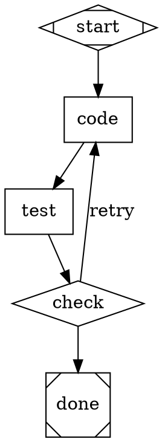

# CLAUDE.md

This file provides guidance to Claude Code (claude.ai/code) when working with code in this repository.

## What This Is

Attractor is a DOT-based directed graph pipeline runner for multi-stage AI workflows. Pipelines are defined as Graphviz `digraph` DOT files where node shapes map to execution types (e.g., `Mdiamond` = start, `Msquare` = exit, `box` = codergen). It also includes a standalone coding agent with tool-use capabilities.

## Commands

```bash
# Setup
python -m venv .venv && source .venv/bin/activate
pip install -e ".[dev,all]"

# Run a pipeline
python -m attractor.cli run examples/hello.dot

# Run with skills
python -m attractor.cli run pipeline.dot --skills-dir ./skills

# Validate a DOT file without executing
python -m attractor.cli validate examples/hello.dot

# Interactive agent chat
python -m attractor.cli chat

# Tests
pytest                          # all tests
pytest tests/pipeline/          # one subsystem
pytest tests/pipeline/test_parser.py::test_name  # single test

# Lint & type check
ruff check .
ruff format --check .
mypy attractor
```

## Architecture

Three major subsystems under `attractor/`:

**`pipeline/`** - DOT graph execution engine. `parser.py` converts DOT source (via pydot) into a `Graph` model (`graph.py`). `runner.py` orchestrates a 5-phase lifecycle: PARSE → VALIDATE → INITIALIZE → EXECUTE → FINALIZE. Each node type has a handler in `handlers/` registered via `HandlerRegistry`. Edge traversal uses `edge_selector.py` with label/condition matching. Supports checkpointing (`checkpoint.py`), retry with backoff (`retry.py`), goal gates (`goal_gate.py`), and model stylesheets (`stylesheet.py`).

**`llm/`** - Multi-provider LLM client. `Client` auto-discovers providers from env vars (`ANTHROPIC_API_KEY`, `OPENAI_API_KEY`, `GEMINI_API_KEY`). Each provider implements the `ProviderAdapter` ABC in `adapters/`. `catalog.py` maps model names to providers. Supports middleware chain and streaming.

**`agent/`** - Coding agent with agentic tool-use loop. `Session` manages state, history, and the `AgentLoop` which runs LLM → tool execution → repeat cycles. Tools (read/write/edit files, shell, glob, grep) are in `agent/tools/`. Includes loop detection and steering injection.

## Skills

Skills are composable bundles of system prompt additions and tool set modifications, referenced from codergen nodes via the `skills` DOT attribute:

```dot
review [shape=box, prompt="Review the diff", skills="code-review,security-audit"];
```

`SkillRegistry` (`agent/skill.py`) loads skills from YAML files (requires pyyaml) or Python modules in a directory via `load_dir()`. Skills can also be registered programmatically. Multiple skills are composed by concatenating system prompts, unioning tool excludes, and collecting custom tools.

A YAML skill file:
```yaml
name: code-review
system_prompt: |
  Focus on logic errors and edge cases.
tools_exclude:
  - write_file
  - edit_file
```

A Python skill module (must export a `skill` attribute, optionally a `tools` list):
```python
from attractor.agent.skill import Skill
skill = Skill(name="deploy", system_prompt="You can deploy to staging.")
tools = [DeployTool()]  # optional custom Tool instances
```

The integration point is `CodergenHandler`: it resolves `node.skills` via the `SkillRegistry`, composes the result, augments the `ProviderProfile.system_prompt`, and builds a modified `ToolRegistry` before creating the `Session`. The `SkillRegistry` is passed through `PipelineRunner` → `default_registry()` → `CodergenHandler`.

When a `SkillRegistry` is provided, the validator (`validation.py`) checks that all skill names referenced in nodes are registered and emits warnings for unknown ones. Use `--skills-dir` on the CLI to load skills from a directory.

## Feedback Loops and Self-Correction

The pipeline supports backward edges and feedback loops for iterative workflows like SDLC pipelines.

**Backward edges** work naturally — the runner follows any edge regardless of direction. Define a backward edge with a condition to create a retry loop:



**Automatic feedback injection**: When a codergen node is re-entered (iteration > 0), it automatically appends prior downstream responses to the prompt under a `--- Feedback from previous iteration ---` section. The LLM sees what failed and why.

**`max_iterations`** (node attribute): Caps how many times a node can be visited. Without this, backward edges are bounded only by the global `max_iterations=1000` runner limit. Set this on nodes that are retry targets.

**`context.internal.node_iteration.<node_id>`**: Tracks visit count per node, usable in edge conditions (e.g., `condition="context.internal.node_iteration.code!=5"` to stop retrying after 5 attempts).

**Goal gates**: Nodes with `goal_gate=true` must achieve `success` or `partial_success` before the pipeline can exit. If unsatisfied at exit, the runner routes to the gate's `retry_target` (or the graph-level `retry_target`/`fallback_retry_target`).

**Edge conditions**: Support `=`, `!=`, `&&`. Variables: `outcome`, `preferred_label`, `context.<key>`.

## Node Types (DOT shape mapping)

`Mdiamond`=start, `Msquare`=exit, `box`=codergen, `hexagon`=wait.human, `diamond`=conditional, `component`=parallel, `tripleoctagon`=fan_in, `parallelogram`=tool, `house`=manager_loop

## DOT Parsing Constraints (spec §2.3)

The parser enforces these constraints via `_pre_validate()` before pydot parsing, and post-parse node ID validation:

- One `digraph` per file — multiple graphs, `graph` (undirected), and `strict` modifier are rejected
- Bare identifiers only for node IDs — must match `[A-Za-z_][A-Za-z0-9_]*`, use `label` for display names
- Commas required between attributes inside `[...]` blocks
- Directed edges only — `->` is the only edge operator, `--` is rejected
- Comments (`//` line and `/* block */`) are supported (handled by pydot)
- Semicolons are optional

## Key Conventions

- Python 3.9+ (target version py311 for ruff). Uses `from __future__ import annotations`.
- Pydantic v2 models throughout for data structures.
- Async-first: pipeline runner and agent loop are async. Tests use `pytest-asyncio` with `asyncio_mode = "auto"`.
- Line length: 100 chars (ruff config).
- Run artifacts go in `runs/` directory (gitignored).
