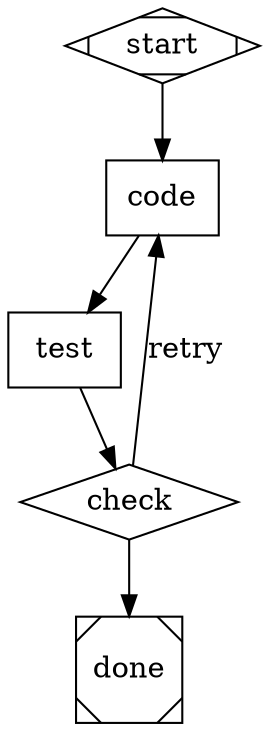

# CLAUDE.md

This file provides guidance to Claude Code (claude.ai/code) when working with code in this repository.

## What This Is

Attractor is a DOT-based directed graph pipeline runner for multi-stage AI workflows, written in Go. Pipelines are defined as Graphviz `digraph` DOT files where node shapes map to execution types (e.g., `Mdiamond` = start, `Msquare` = exit, `box` = codergen). It also includes a standalone coding agent with tool-use capabilities. The project builds to a single static binary.

The module path is `github.com/nigelpepper/attractor`. Library code lives under `internal/`; the CLI is `cmd/attractor`.

## Commands

```bash
# Build the binary
go build -o attractor ./cmd/attractor

# Run a pipeline (needs a provider key in the environment)
ANTHROPIC_API_KEY=... ./attractor run examples/hello.dot

# Run with skills
./attractor run pipeline.dot --skills-dir ./skills

# Validate a DOT file without executing
./attractor validate examples/hello.dot

# Interactive agent chat
./attractor chat

# Tests
go test ./...                                   # all tests
go test ./internal/pipeline/                    # one subsystem
go test ./internal/pipeline/ -run TestParseCLI  # single test

# Vet & format
go vet ./...
gofmt -l .   # list files needing formatting
gofmt -w .   # apply formatting
```

## Architecture

Three major subsystems under `internal/`, plus shared error types in `internal/aerr`:

**`pipeline/`** - DOT graph execution engine. `parser.go` converts DOT source into a `Graph` model (`graph.go`) using `gographviz` for the AST, with a strict `preValidate` pass enforcing the spec before parsing. Because `gographviz.Read` rejects non-standard attribute names, the parser uses `gographviz.Parse` + `Analyse` through a permissive `collector` that preserves the custom DSL attributes (`goal`, `prompt`, `condition`, ...). `runner.go` orchestrates a 5-phase lifecycle: PARSE → VALIDATE → INITIALIZE → EXECUTE → FINALIZE. Each node type has a handler (`handler_*.go`, `handlers_simple.go`) registered via `HandlerRegistry`. Edge traversal uses `edgeselector.go` with label/condition matching. Supports checkpointing (`checkpoint.go`), retry with backoff (`retry.go`), goal gates (`goalgate.go`), and model stylesheets (`stylesheet.go`). Handlers live in the `pipeline` package itself (not a subpackage) so the package can import `agent` without a cycle.

**`llm/`** - Multi-provider LLM client. `Client` (`client.go`) routes requests to registered providers through a middleware chain. `adapters.FromEnv` (`adapters/fromenv.go`) auto-discovers providers from env vars (`ANTHROPIC_API_KEY`, `OPENAI_API_KEY`, `GEMINI_API_KEY`). Each provider implements the `ProviderAdapter` interface in `adapters/`, backed by the official Go SDKs (`anthropic-sdk-go`, `openai-go`, Google `genai`). `catalog.go` maps model names to providers. Streaming (`Stream`) is currently a synthetic stream over `Complete` — the agent loop only uses `Complete`.

**`agent/`** - Coding agent with agentic tool-use loop. `Session` manages state, history, and the `AgentLoop` which runs LLM → tool execution → repeat cycles. Tools (read/write/edit files, shell, glob, grep) and the `ExecutionEnvironment` abstraction live in `agent/tools/`. Includes loop detection and steering injection. The flow is synchronous, using `context.Context` for cancellation; the pipeline's parallel handler uses goroutines.

## Skills

Skills are composable bundles of system prompt additions and tool set modifications, referenced from codergen nodes via the `skills` DOT attribute:

```dot
review [shape=box, prompt="Review the diff", skills="code-review,security-audit"];
```

`SkillRegistry` (`agent/skill.go`) loads skills from YAML files in a directory via `LoadDir()`, or registers them programmatically with `Register()`. Multiple skills are composed by concatenating system prompts, unioning tool excludes, and collecting custom tools.

A YAML skill file (plain mapping, or a `---`-delimited frontmatter block whose prose body becomes `system_prompt`):
```yaml
name: code-review
system_prompt: |
  Focus on logic errors and edge cases.
tools_exclude:
  - write_file
  - edit_file
```

Python skill modules (the `.py` form supported by the old Python build) are **not** supported in the Go build — `LoadDir` skips `.py` files with a warning. Custom Go tools can be attached to a skill via `Register(skill, customTools)`.

The integration point is `CodergenHandler` (`handler_codergen.go`): it resolves `node.Skills()` via the `SkillRegistry`, composes the result, augments the system prompt, and builds a modified `tools.ToolRegistry` before creating the `Session`. The `SkillRegistry` is passed through `PipelineRunner` → `DefaultRegistry()` → `CodergenHandler`.

When a `SkillRegistry` is provided, the validator (`validation.go`) checks that all skill names referenced in nodes are registered and emits warnings for unknown ones. Use `--skills-dir` on the CLI to load skills from a directory.

## Feedback Loops and Self-Correction

The pipeline supports backward edges and feedback loops for iterative workflows like SDLC pipelines.

**Backward edges** work naturally — the runner follows any edge regardless of direction. Define a backward edge with a condition to create a retry loop:



**Automatic feedback injection**: When a codergen node is re-entered (iteration > 0), it automatically appends prior downstream responses to the prompt under a `--- Feedback from previous iteration ---` section. The LLM sees what failed and why.

**`max_iterations`** (node attribute): Caps how many times a node can be visited. Without this, backward edges are bounded only by the global 1000-iteration runner limit. Set this on nodes that are retry targets.

**`context.internal.node_iteration.<node_id>`**: Tracks visit count per node, usable in edge conditions (e.g., `condition="context.internal.node_iteration.code!=5"` to stop retrying after 5 attempts).

**Goal gates**: Nodes with `goal_gate=true` must achieve `success` or `partial_success` before the pipeline can exit. If unsatisfied at exit, the runner routes to the gate's `retry_target` (or the graph-level `retry_target`/`fallback_retry_target`).

**Edge conditions**: Support `=`, `!=`, `&&`. Variables: `outcome`, `preferred_label`, `context.<key>`.

## Node Types (DOT shape mapping)

`Mdiamond`=start, `Msquare`=exit, `box`=codergen, `hexagon`=wait.human, `diamond`=conditional, `component`=parallel, `tripleoctagon`=fan_in, `parallelogram`=tool, `house`=manager_loop

## DOT Parsing Constraints (spec §2.3)

The parser enforces these constraints via `preValidate()` before the gographviz parse, plus post-parse node ID validation:

- One `digraph` per file — multiple graphs, `graph` (undirected), and `strict` modifier are rejected
- Bare identifiers only for node IDs — must match `[A-Za-z_][A-Za-z0-9_]*`, use `label` for display names
- Commas required between attributes inside `[...]` blocks
- Directed edges only — `->` is the only edge operator, `--` is rejected
- Comments (`//` line and `/* block */`) are supported
- Semicolons are optional

## Key Conventions

- Go 1.26; standard `gofmt` formatting; `go vet` clean.
- Typed error hierarchy in `internal/aerr` (`ParseError`, `PipelineError`, `ValidationError`, `ProviderError`, `RateLimitError`, ...); `retry.IsRetryable` classifies provider errors by status code.
- Data structures are plain structs with `encoding/json` tags. Checkpoint/status JSON field names are kept identical to the historical Python schema so prior runs remain loadable.
- Synchronous control flow with `context.Context`; goroutines only in the parallel handler.
- Node IDs: bare identifiers only (`[A-Za-z_][A-Za-z0-9_]*`).
- Run artifacts go in the `runs/` directory (gitignored). The build output `attractor-bin`/`attractor` is gitignored.
