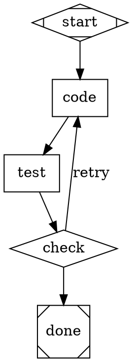

# Attractor

A DOT-based directed graph pipeline runner for multi-stage AI workflows.

## Table of Contents

- [Quick Start](#quick-start)
- [Installation](#installation)
- [Attractor](#attractor)
- [Architecture](#architecture)
- [Development](#development)

## Quick Start

### Setup

```bash
./setup.sh
source .venv/bin/activate
```

### Quick Start

```bash
# Validate a DOT pipeline file
python -m attractor.cli validate examples/hello.dot

# Run a pipeline
python -m attractor.cli run examples/hello.dot

# Run with skills
python -m attractor.cli run pipeline.dot --skills-dir ./skills

# Interactive coding agent
python -m attractor.cli chat
```

## Installation

### System Requirements
- Python 3.9 or higher (3.11 recommended)
- macOS, Linux, or Windows with bash/zsh

### From Source

1. **Clone and setup virtual environment:**
   ```bash
   git clone <repo>
   cd <repo>
   ./setup.sh
   source .venv/bin/activate
   ```

2. **Install dependencies:**
   ```bash
   pip install -e ".[dev,all]"
   ```

## Attractor

Attractor is a workflow orchestration engine for building multi-stage AI pipelines using Graphviz DOT notation. It supports multiple LLM providers (Anthropic, OpenAI, Google Gemini) and enables complex retry loops, feedback injection, and conditional routing.

### Features

**DOT-Based Pipelines**
- Graphviz DOT format for graph definition
- Rich node types: start, exit, codergen, conditional, parallel, etc.
- Automatic validation and preprocessing

**Multi-Provider LLM Support**
- Anthropic Claude (via `ANTHROPIC_API_KEY`)
- OpenAI (via `OPENAI_API_KEY`)
- Google Gemini (via `GEMINI_API_KEY`)
- Easy provider switching per node

**Agentic Capabilities**
- Tool-using coding agent with file I/O, shell execution, and glob/grep
- Streaming support
- Custom tool registration

**Advanced Workflows**
- Backward edges and feedback loops
- Automatic feedback injection on retry
- Node-level iteration caps (`max_iterations`)
- Goal gates for success validation
- Edge conditions with variable substitution
- Checkpointing and recovery

**Skills System**
- Composable system prompt and tool modifications
- YAML and Python skill definitions
- Multi-skill composition on single nodes

### Example Pipeline



### Node Types

| Shape | Type | Purpose |
|-------|------|---------|
| `Mdiamond` | start | Pipeline entry point |
| `Msquare` | exit | Pipeline exit |
| `box` | codergen | LLM-powered coding task |
| `diamond` | conditional | Branch based on condition |
| `hexagon` | wait.human | Pause for human input |
| `component` | parallel | Run multiple paths in parallel |
| `parallelogram` | tool | Execute a tool directly |
| `house` | manager_loop | Hierarchical loop management |

## Architecture

### Three Core Subsystems

**`attractor/pipeline/`** – Execution Engine
- `parser.py`: Converts DOT source to `Graph` model via pydot
- `runner.py`: 5-phase lifecycle (PARSE → VALIDATE → INITIALIZE → EXECUTE → FINALIZE)
- `handlers/`: Node type handlers registered in `HandlerRegistry`
- `edge_selector.py`: Intelligent edge traversal with label and condition matching
- `checkpoint.py`, `retry.py`, `goal_gate.py`, `stylesheet.py`: Specialized features

**`attractor/llm/`** – LLM Abstraction
- `Client`: Auto-discovers LLM providers from environment variables
- `adapters/`: Provider implementations (Anthropic, OpenAI, Gemini)
- `catalog.py`: Model → provider mapping
- Middleware chain for extensibility

**`attractor/agent/`** – Coding Agent
- `Session`: State and history management
- `AgentLoop`: LLM → tool → repeat cycle
- `agent/tools/`: File I/O, shell, glob, grep, and custom tools
- Loop detection and correction injection

## Development

### Setup

```bash
./setup.sh
source .venv/bin/activate
pip install -e ".[dev,all]"
```

### Commands

```bash
# Run tests
pytest                              # All tests
pytest tests/pipeline/              # One subsystem
pytest tests/pipeline/test_parser.py::test_name  # Single test

# Lint & format
ruff check .
ruff format --check .
ruff format .  # Apply fixes

# Type checking
mypy attractor

# Run pipeline
python -m attractor.cli run examples/hello.dot

# Interactive agent
python -m attractor.cli chat
```

### Code Conventions

- **Python**: 3.9+ with annotations (`from __future__ import annotations`)
- **Data models**: Pydantic v2
- **Async**: Async-first (tests use `pytest-asyncio`)
- **Line length**: 100 characters (ruff)
- **Node IDs**: Bare identifiers only (`[A-Za-z_][A-Za-z0-9_]*`)
- **Comments**: Only for WHY, not WHAT

### DOT Spec Constraints

- One `digraph` per file (no `graph`, `strict`, or multiple graphs)
- Bare identifiers for node IDs, use `label` for display names
- Commas between attributes in `[...]`
- Directed edges only (`->`, no `--`)
- Comments: `//` line, `/* block */`
- Semicolons optional

## Feedback Loops & Self-Correction

Pipelines support backward edges for retry and feedback:

```dot
code  -> test;
test  -> check;
check -> code  [label="retry", condition="outcome=fail"];
check -> done  [condition="outcome=success"];
```

When a node is re-entered, prior feedback is automatically appended:
```
--- Feedback from previous iteration ---
Error: Test failed – IndexError on line 42
```

Use `max_iterations=<n>` to cap retries per node.

## License

Apache License 2.0 – See [LICENSE](LICENSE) for details.

## Support

- **Attractor issues**: Review pipeline DOT syntax and provider configuration
- **Development help**: Run `pytest -v` for detailed test output
