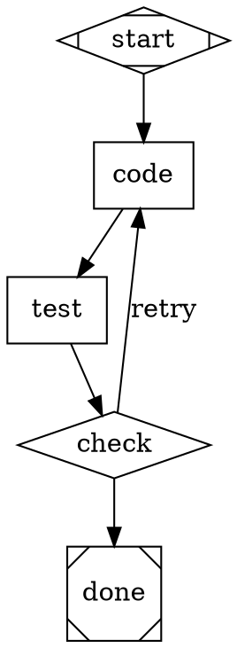

# Attractor

A DOT-based directed graph pipeline runner for multi-stage AI workflows, with a
built-in tool-using coding agent. Written in Go — it builds to a single static
binary.

## Table of Contents

- [Quick Start](#quick-start)
- [Installation](#installation)
- [Attractor](#attractor)
- [Architecture](#architecture)
- [Development](#development)

## Quick Start

```bash
# Build the binary
go build -o attractor ./cmd/attractor

# Validate a DOT pipeline file
./attractor validate examples/hello.dot

# Run a pipeline (needs a provider key in the environment)
ANTHROPIC_API_KEY=... ./attractor run examples/hello.dot

# Run with skills
./attractor run pipeline.dot --skills-dir ./skills

# Interactive coding agent
./attractor chat
```

## Installation

### System Requirements
- Go 1.26 or higher
- macOS, Linux, or Windows
- `ripgrep` (optional; the agent's `grep` tool falls back to `grep`)

### From Source

```bash
git clone <repo>
cd attractor
go build -o attractor ./cmd/attractor
```

Set whichever provider keys you have — Attractor registers only the providers it
finds credentials for:

```bash
export ANTHROPIC_API_KEY=...   # Claude
export OPENAI_API_KEY=...      # GPT
export GEMINI_API_KEY=...      # Gemini
```

### Sandboxed run (Docker)

`bin/attractor` runs the CLI inside a hardened container (read-only root, dropped
capabilities, your cwd mounted read-only, `./runs/` mounted read-write). On macOS
it reads `ANTHROPIC_API_KEY` from the login keychain:

```bash
bin/attractor run examples/hello.dot
```

## Attractor

Attractor is a workflow orchestration engine for building multi-stage AI
pipelines using Graphviz DOT notation. It supports multiple LLM providers
(Anthropic, OpenAI, Google Gemini) and enables retry loops, feedback injection,
and conditional routing.

### Features

**DOT-Based Pipelines**
- Graphviz DOT format for graph definition
- Rich node types: start, exit, codergen, conditional, parallel, etc.
- Automatic validation and preprocessing

**Multi-Provider LLM Support**
- Anthropic Claude (via `ANTHROPIC_API_KEY`)
- OpenAI (via `OPENAI_API_KEY`)
- Google Gemini (via `GEMINI_API_KEY`)
- Per-node provider/model override

**Agentic Capabilities**
- Tool-using coding agent with file I/O, shell execution, and glob/grep
- Loop detection and steering injection
- Custom tool registration

**Advanced Workflows**
- Backward edges and feedback loops
- Automatic feedback injection on retry
- Node-level iteration caps (`max_iterations`)
- Goal gates for success validation
- Edge conditions with variable substitution
- Checkpointing and recovery (`--resume`, `--restart-from-success`)

**Skills System**
- Composable system-prompt and tool-set modifications
- YAML skill definitions (with optional `---` frontmatter)
- Multi-skill composition on a single node

### Example Pipeline



### Node Types

| Shape | Type | Purpose |
|-------|------|---------|
| `Mdiamond` | start | Pipeline entry point |
| `Msquare` | exit | Pipeline exit |
| `box` | codergen | LLM-powered coding task |
| `diamond` | conditional | Branch based on condition |
| `hexagon` | wait.human | Pause for human input |
| `component` | parallel | Run multiple paths in parallel |
| `parallelogram` | tool | Execute a shell command directly |
| `house` | manager_loop | Hierarchical loop management |

## Architecture

The Go module is `github.com/nigelpepper/attractor`. Source lives under
`internal/` (libraries) and `cmd/attractor` (the CLI).

**`internal/pipeline/`** – Execution engine
- `parser.go`: DOT → `Graph` via gographviz, with strict pre-validation
- `runner.go`: 5-phase lifecycle (PARSE → VALIDATE → INITIALIZE → EXECUTE → FINALIZE)
- `handler_*.go`: node-type handlers registered in `HandlerRegistry`
- `edgeselector.go`: edge traversal with label and condition matching
- `checkpoint.go`, `retry.go`, `goalgate.go`, `stylesheet.go`: specialized features

**`internal/llm/`** – LLM abstraction
- `Client`: routes requests to registered providers via a middleware chain
- `adapters/`: provider implementations on the official Go SDKs (Anthropic, OpenAI, Gemini)
- `adapters.FromEnv`: auto-discovers providers from environment variables
- `catalog.go`: model → provider mapping

**`internal/agent/`** – Coding agent
- `Session`: state and history management
- `AgentLoop`: LLM → tool → repeat cycle
- `tools/`: file I/O, shell, glob, grep, plus the execution-environment abstraction
- Loop detection and steering injection

## Development

### Commands

```bash
# Build
go build -o attractor ./cmd/attractor

# Tests
go test ./...                                  # all tests
go test ./internal/pipeline/                   # one subsystem
go test ./internal/pipeline/ -run TestParseCLI # single test

# Vet & format
go vet ./...
gofmt -l .        # list files needing formatting
gofmt -w .        # apply formatting

# Run a pipeline
./attractor run examples/hello.dot

# Interactive agent
./attractor chat

# Watch a pipeline run live in the browser
./attractor run examples/hello.dot --web          # opens http://127.0.0.1:8765
# Browse prior runs without executing anything
./attractor serve --runs-dir runs --port 8765
```

### Web UI

`--web` on `run` (or the standalone `serve` command) launches a live pipeline
visualizer at `http://127.0.0.1:8765`. It renders the DOT graph with
d3-graphviz, colours nodes by status as events stream in over Server-Sent
Events, and shows each node's prompt/response/status in a side panel. `serve`
works over the `runs/` directory alone, so finished runs stay inspectable.
The frontend assets are embedded into the binary (`go:embed`); no build step.

### Code Conventions

- **Go** 1.26; standard `gofmt` formatting
- **Errors**: typed error hierarchy in `internal/aerr`
- **Concurrency**: synchronous flow with `context.Context`; goroutines for parallel nodes
- **Node IDs**: bare identifiers only (`[A-Za-z_][A-Za-z0-9_]*`)
- **Comments**: only for WHY, not WHAT

### DOT Spec Constraints

- One `digraph` per file (no `graph`, `strict`, or multiple graphs)
- Bare identifiers for node IDs; use `label` for display names
- Commas between attributes in `[...]`
- Directed edges only (`->`, no `--`)
- Comments: `//` line, `/* block */`
- Semicolons optional

## Feedback Loops & Self-Correction

Pipelines support backward edges for retry and feedback:

```dot
code  -> test;
test  -> check;
check -> code  [label="retry", condition="outcome=fail"];
check -> done  [condition="outcome=success"];
```

When a node is re-entered, prior downstream feedback is automatically appended:

```
--- Feedback from previous iteration ---
Error: Test failed – IndexError on line 42
```

Use `max_iterations=<n>` to cap retries per node.

## License

Apache License 2.0 – See [LICENSE](LICENSE) for details.
